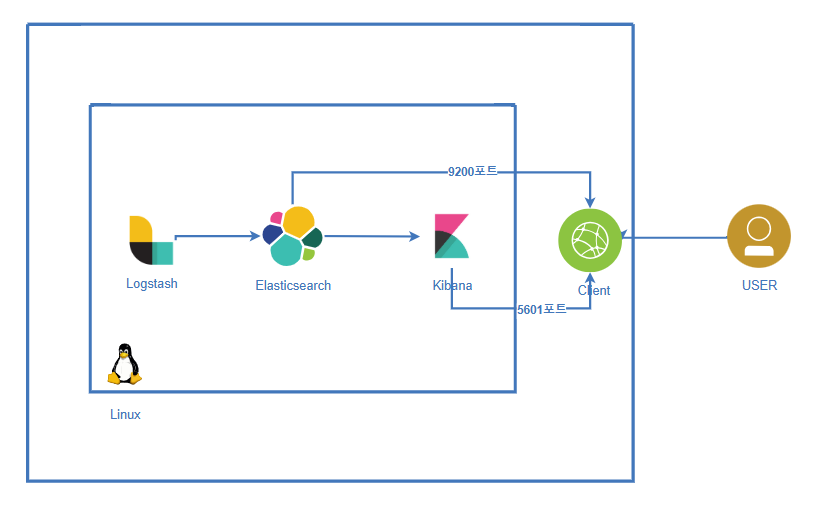
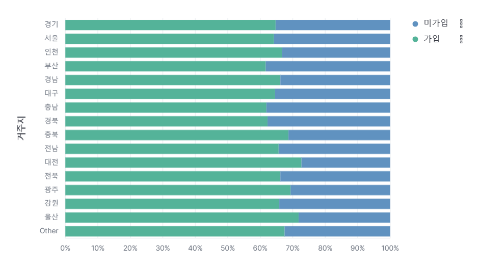

# 💳 Card Data Analyzing: 광고 노출 최적화 프로젝트
| **Ubuntu에서의 ELK Stack 설치 및 실 금융 데이터를 기반한 Kibana 시각화**
  

## 👨‍👨‍👦‍👦 Team

👥 팀명 : 구구구칠

|||||
|:-:|:-:|:-:|:-:|
|김민성 [@minsung159357](https://github.com/minsung159357)|SeulGi_LEE [@seulg2027](https://github.com/seulg2027)|HanJH [@letsgojh0810](https://github.com/letsgojh0810)|구민지 [@minjee83](https://github.com/minjee83)|

 

## 🎯 프로젝트 목표

📌 개요 : 본 프로젝트는 카드 소비 데이터를 분석하여 **개인화된 추천 시스템을 구현**한다. Linux OS에서 ELK 를 활용해 나이별, 지역별, 라이프별로 소비가 집중되는 업종을 파악한다.

📌 목표 : 카드 소비 데이터 분석을 통해 **비대면 모바일 채널에서 광고 노출 유형을 최적화**하여 고객 소비를 증대시키고, 이를 통해 **수익 창출을 도모**한다.

📌 데이터 수집 : 실 사용되는 카드 소비 데이터를 가지고 Elasticsearch의 index에 등록한다.

 

## 🔍 핵심 아이디어
### 1. 데이터 세분화 전략
인구통계학적으로 데이터를 세분화해서 분석한다. 
  - `나이별` 소비 패턴
  - `지역별` 소비 트렌드
  - `라이프스테이지별` 소비 특성

 

### 2. 채널 맞춤 광고 전략

 

## 📊 인프라 및 아키텍처
### ELK 스택 구축

## 🛠 주요 기술

Linux에 ELK를 설치하고 기본 세팅을 진행하며 기술한 내용은 다음 링크에 있습니다.  
[기술 내용 보러가기](./setting/README.md)

- 데이터 분석 프로세스

  
  

# 📊 우리카드 소비 데이터 분석 인사이트

## 1. 데이터 시각화 개요
소비자 세분화를 위한 6가지 데이터 분석 관점

### 📈 분석 차원
1. 나이별 소비 패턴
2. 지역별 소비 트렌드 
3. 라이프스테이지별 소비 특성
 

## 2. 데이터 인사이트 상세

### 2.1 나이별 소비 분석
#### 연령대별 주요 소비 분야

|     | 20대                              | 30대                              | 40대                              | 50대                              | 60대 이상                         |
|----------------|-----------------------------------|-----------------------------------|-----------------------------------|-----------------------------------|-----------------------------------|
| 주요 소비 분야 | - 온라인 쇼핑 - 외식 - 여행 | - 육아용품 - 교육 - 생활용품 | - 자녀 교육 - 가전제품 - 보험 | - 의료서비스 - 여행 - 자기계발 | - 의료 - 건강관리 - 생활용품 |

### 2.2 지역별 소비 트렌드
#### 주요 지역 특성

|             | 서울                                | 경기                               | 부산                 | 대구                               | 제주                 |
|----------------|-----------------------------------|-----------------------------------|--------------------|-----------------------------------|--------------------|
| 주요 소비 특성 | - 고급 소비재 - 문화생활         | - 실용적 소비 - 가족 중심 지출 | - 해운/관광 관련 소비 | - 전통시장 - 지역 중소기업 제품 | - 관광/여행 관련 소비 |

### 2.3 라이프스테이지별 소비 특성

## 라이프스테이지별 소비 특성 분석

| 라이프스테이지 | 주요 소비 분야 | 마케팅 포인트 |
|--------------|--------------|--------------|
| 대학생 | - 교육 - 온라인 쇼핑 | - 학생 할인 - 청년 특화 상품 |
| 신혼/영유아 부모 | - 육아용품 - 가전제품 | - 육아 관련 금융 서비스 |
| 자녀 학령기 부모 | - 교육 - 학원비 | - 교육 관련 금융 상품 |
| 사회초년생 | - 자기계발 - 문화생활 | - 취업/자격증 대출 |
| 은퇴/시니어 | - 건강관리 - 여행 | - 건강보험 - 은퇴 설계 |

## 2.4 비대면 채널 가입 여부
### 나이별 가입 여부
 

> ✨ 25 ~ 35살이 비대면 채널을 가장 많이 가입했고, 50대 이후로 미가입율이 상승하는 것을 알 수 있다.  

### 지역별 가입 여부
 

> ✨ 충남, 경북, 부산 지역에 거주하는 사람들은 비대면 채널을 덜 가입했고, 대전, 울산 지역에 거주하는 사람들은 가입율이 높았다.  

### 라이프스타일별 가입 여부

> ✨ 은퇴하거나 중년인 사람들은 주로 미가입 상태였으며, 자녀가 어리거나 사회초년생, 신혼 등 소비를 활발하게 하는 사람들의 경우 주로 가입한 상태였다.

📢 결과 : 50대 이전이고, 자녀가 어리거나 신혼이며 가입율이 높은 지역에 거주하는 사람들에게는 앱 푸시로 광고를 노출한다. 반대로, 50대 이후이며 은퇴하거나 가입율이 낮은 지역에 거주하는 사람들에게는 문자로 광고를 노출한다.

 

## 3. 마케팅 전략 제안
### 🚀 채널별 맞춤 접근

## 💡 4. 기대 효과

>  카드 소비 데이터를 분석하여 비대면 모바일 채널에서 광고 노출 유형을 최적화함으로써 고객 소비를 증대시키고 이를 기반으로 수익 창출을 도모합니다.  
>  이 과정에서 타겟팅 정확도를 높이고, 고객 경험을 최적화하
> 프로젝트를 통해 데이터 기반 마케팅 전략을 효과적으로 수립할 수 있었으며,실 사용 데이터를 활용하여 목표 정확도를 더욱 향상시켰으며
이를 바탕으로 광고 효율성 또한 크게 증대시킬 수 있습니다.

