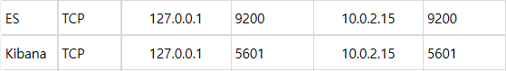
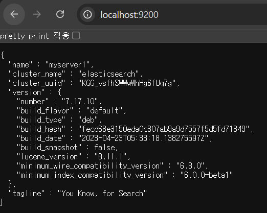
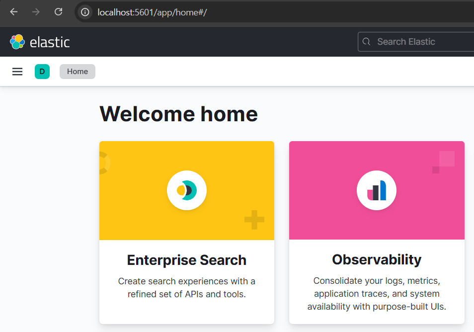
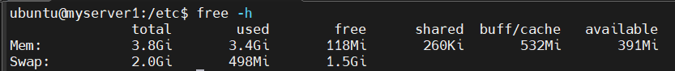

# 💳 Woori Card Data Analyzing: 광고 노출 최적화 프로젝트
| **Install ELK in ubuntu and practice ELK using Woori card data**
<br></br>
## 🎯 프로젝트 목표
모바일 채널의 광고 노출 빈도를 효율적으로 조절하여 고객 소비 증대
</br>
</br>
## 🔍 핵심 아이디어
### 1. 데이터 세분화 전략
- 인구통계학적 분석
  - 나이별 소비 패턴
  - 지역별 소비 트렌드
  - 라이프스테이지별 소비 특성

### 2. 채널 맞춤 광고 전략
비대면 채널 가입자

- 앱 푸시 광고 노출
- 개인화된 타겟팅

비대면 채널 미가입자

- SMS 문자 광고 발송
- 가입 유도를 위한 연회비 인센티브 제공
</br>

## 📊 데이터 분석 인프라
### ELK 스택 구축
- Elasticsearch
- Logstash
- Kibana
</br>

## 🛠 주요 기술
- 데이터 수집
- 데이터 처리
- 시각화
- 인사이트 도출
</br>


## 👨‍👨‍👦‍👦 Team

👥 팀명 : 구구구칠

|||||
|:-:|:-:|:-:|:-:|
|김민성<br/>[@minsung159357](https://github.com/minsung159357)|SeulGi_LEE<br/>[@seulg2027](https://github.com/seulg2027)|HanJH<br/>[@letsgojh0810](https://github.com/letsgojh0810)|구민지<br/>[@minjee83](https://github.com/minjee83)|


## 📝 상세 가이드
## ⚙️ How to install ELK in ubuntu
<p></p>
<p></p>
### 1. Install ELK ⬇️
```bash
-- Elastic Search Install
wget -qO - https://artifacts.elastic.co/GPG-KEY-elasticsearch | sudo apt-key add -

echo "deb https://artifacts.elastic.co/packages/7.x/apt stable main" | sudo tee -a /etc/apt/sources.list.d/elastic-7.x.list

sudo apt update
sudo apt install elasticsearch=7.17.10

sudo systemctl enable elasticsearch
sudo systemctl start elasticsearch


-- Logstash Install
wget -qO - https://artifacts.elastic.co/GPG-KEY-elasticsearch | sudo apt-key add -
sudo sh -c 'echo "deb https://artifacts.elastic.co/packages/7.x/apt stable main" > /etc/apt/sources.list.d/elastic-7.x.list'
sudo apt update

sudo apt install -y logstash
logstash --version

sudo systemctl start logstash
sudo systemctl enable logstash


-- Kibana Install
echo "deb https://artifacts.elastic.co/packages/7.x/apt stable main" | sudo tee /etc/apt/sources.list.d/elastic-7.x.list
sudo apt update
sudo apt install kibana=7.17.10 -y
```
<p></p>
<br></br>

### 2. Elasticsearch, Kibana yml 설정 ⚙️

- elasticsearch.yml 수정
```yml
# ---------------------------------- Network -----------------------------------
#
# By default Elasticsearch is only accessible on localhost. Set a different
# address here to expose this node on the network:
#
network.host: 0.0.0.0
#
# By default Elasticsearch listens for HTTP traffic on the first free port it
# finds starting at 9200. Set a specific HTTP port here:
#
http.port: 9200
```

- kibana.yml 수정
```yml
# Specifies the address to which the Kibana server will bind. IP addresses and host names are both valid values.
# The default is 'localhost', which usually means remote machines will not be able to connect.
# To allow connections from remote users, set this parameter to a non-loopback address.
server.host: 0.0.0.0


# The URLs of the Elasticsearch instances to use for all your queries.
elasticsearch.hosts: ["http://localhost:9200"]
```
<p></p>
<br></br>

### 3. 포트 포워딩 🔌


- ubuntu에서 해당 포트에 대해 모두 포워딩 설정

<br>
<br>
<p></p>

### 4. 정상 실행 확인 🚀

</br>
</br>


- elastic search 확인

<br>
<br>

- Kibana 확인
<br>

<br>
<br>

-> EK, Kibama 모두 정상적으로 실행되는 것 확인 완료
<br>
<br>

### 5. Trouble Shooting 💥
<br>
<br>
<details>
  <summary><span style="font-size: 16px; font-weight: bold;">&nbsp[문제 1]  Ubuntu RAM 메모리 부족 문제</span></summary>
  <br>
  
  - ELK 를 설치하는 중 free -h를 확인해보니 메모리가 부족한 것을 확인
  <br>

  - 해결 방법 : Swap Memory 공간 확장
```bash
sudo fallocate -l 2G /swapfile
sudo chmod 600 /swapfile
sudo mkswap /swapfile
sudo swapon /swapfile

echo '/swapfile none swap sw 0 0' | sudo tee -a /etc/fstab
```

<p></p>
  <span style="color: orange; font-szie: 14px; font-weight: bold"> -> 정상적으로 2GB 설정된 것을 확인 </span>

</details>
<br>
<details>
  <summary><span style="font-size: 16px; font-weight: bold;">&nbsp[문제 2] IP 와 port도 모두 열어줬지만 ES가 실행 되지 않는 문제</span></summary>
  <br>

  - 해결 방법 : elasticsearch.yml 파일에 single node 옵션 추가
```yml
# --------------------------------- Discovery ----------------------------------
#
# Pass an initial list of hosts to perform discovery when this node is started:
# The default list of hosts is ["127.0.0.1", "[::1]"]
#
#discovery.seed_hosts: ["host1", "host2"]
discovery.type : single-node
```
💡 단일 노드 모드에서 ES를 실행하려면, 클러스터 구성을 비활성화하고 단일 노드 로 설정해야함. yml 파일에서 discovery.type : single-node로 설정해야 ES는 클러스터 구성을 시도하지 않고 단일 노드로만 동작하게 됨.
<p></p>
  <span style="color: orange; font-szie: 14px; font-weight: bold"> -> 개발/테스트 환경에서는 single-node로 설정하는 것이 필수</span>
</details>


<br></br>
# 👀 Hands On
# 📊 우리카드 소비 데이터 분석 인사이트

## 1. 데이터 시각화 개요
소비자 세분화를 위한 6가지 데이터 분석 관점

### 📈 분석 차원
1. 나이별 소비 패턴
2. 지역별 소비 트렌드 
3. 라이프스테이지별 소비 특성

## 2. 고객 세분화 전략

### 🎯 채널별 마케팅 접근법
- **비대면 채널 가입자**: 앱 푸시 광고 
- **비대면 채널 미가입자**: SMS 문자 광고
  - 가입 인센티브: 연회비 절감

## 3. 데이터 인사이트 상세

### 3.1 나이별 소비 분석
#### 연령대별 주요 소비 분야


| 연령대 | 주요 소비 분야 |
|--------|----------------|
| 20대 | - 온라인 쇼핑<br>- 외식<br>- 여행 |
| 30대 | - 육아용품<br>- 교육<br>- 생활용품 |
| 40대 | - 자녀 교육<br>- 가전제품<br>- 보험 |
| 50대 | - 의료서비스<br>- 여행<br>- 자기계발 |
| 60대 이상 | - 의료<br>- 건강관리<br>- 생활용품 |

### 3.2 지역별 소비 트렌드
#### 주요 지역 특성


| 지역 | 주요 소비 특성 |
|------|----------------|
| 서울 | - 고급 소비재<br>- 문화생활 |
| 경기 | - 실용적 소비<br>- 가족 중심 지출 |
| 부산 | - 해운/관광 관련 소비 |
| 대구 | - 전통시장<br>- 지역 중소기업 제품 |
| 제주 | - 관광/여행 관련 소비 |

### 3.3 라이프스테이지별 소비 특성


## 라이프스테이지별 소비 특성 분석

| 라이프스테이지 | 주요 소비 분야 | 마케팅 포인트 |
|--------------|--------------|--------------|
| 대학생 | - 교육<br>- 온라인 쇼핑 | - 학생 할인<br>- 청년 특화 상품 |
| 신혼/영유아 부모 | - 육아용품<br>- 가전제품 | - 육아 관련 금융 서비스 |
| 자녀 학령기 부모 | - 교육<br>- 학원비 | - 교육 관련 금융 상품 |
| 사회초년생 | - 자기계발<br>- 문화생활 | - 취업/자격증 대출 |
| 은퇴/시니어 | - 건강관리<br>- 여행 | - 건강보험<br>- 은퇴 설계 |

### 3.4 비대면 채널 가입 여부
## 나이별 가입 여부


## 지역별 가입 여부


## 라이프스타일별 가입 여부


## 4. 마케팅 전략 제안

### 🚀 채널별 맞춤 접근
1. 비대면 채널 가입자
   - 개인화된 앱 푸시 광고
   - 실시간 맞춤형 혜택 제공

2. 비대면 채널 미가입자
   - SMS 타겟 광고
   - 채널 가입 유도 인센티브
     * 연회비 절감
     * 초기 가입 혜택

## 💡 5. 기대 효과
- 타겟팅 정확도 향상
- 고객 경험 최적화
- 광고 효율성 증대
- 데이터 기반 마케팅 전략 수립
