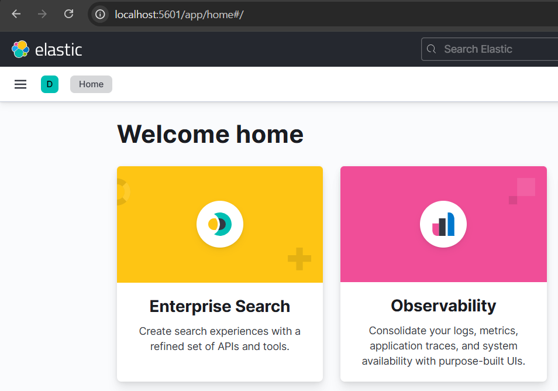

## ⚙️ How to install ELK in ubuntu
<p></p>
<p></p>

### 1. Install ELK ⬇️

```bash
-- Elastic Search Install
wget -qO - https://artifacts.elastic.co/GPG-KEY-elasticsearch | sudo apt-key add -

echo "deb https://artifacts.elastic.co/packages/7.x/apt stable main" | sudo tee -a /etc/apt/sources.list.d/elastic-7.x.list

sudo apt update
sudo apt install elasticsearch=7.17.10

sudo systemctl enable elasticsearch
sudo systemctl start elasticsearch


-- Logstash Install
wget -qO - https://artifacts.elastic.co/GPG-KEY-elasticsearch | sudo apt-key add -
sudo sh -c 'echo "deb https://artifacts.elastic.co/packages/7.x/apt stable main" > /etc/apt/sources.list.d/elastic-7.x.list'
sudo apt update

sudo apt install -y logstash
logstash --version

sudo systemctl start logstash
sudo systemctl enable logstash


-- Kibana Install
echo "deb https://artifacts.elastic.co/packages/7.x/apt stable main" | sudo tee /etc/apt/sources.list.d/elastic-7.x.list
sudo apt update
sudo apt install kibana=7.17.10 -y
```
<p></p>
<br></br>

### 2. Elasticsearch, Kibana yml 설정 ⚙️

- elasticsearch.yml 수정
```yml
# ---------------------------------- Network -----------------------------------
#
# By default Elasticsearch is only accessible on localhost. Set a different
# address here to expose this node on the network:
#
network.host: 0.0.0.0
#
# By default Elasticsearch listens for HTTP traffic on the first free port it
# finds starting at 9200. Set a specific HTTP port here:
#
http.port: 9200
```

- kibana.yml 수정
```yml
# Specifies the address to which the Kibana server will bind. IP addresses and host names are both valid values.
# The default is 'localhost', which usually means remote machines will not be able to connect.
# To allow connections from remote users, set this parameter to a non-loopback address.
server.host: 0.0.0.0


# The URLs of the Elasticsearch instances to use for all your queries.
elasticsearch.hosts: ["http://localhost:9200"]
```
<p></p>
<br></br>

### 3. 포트 포워딩 🔌


- ubuntu에서 해당 포트에 대해 모두 포워딩 설정

<br>


### 4. 정상 실행 확인 🚀

- elastic search 확인

<br>
<br>

- Kibana 확인
<br>

<br>
<br>

-> EK, Kibama 모두 정상적으로 실행되는 것 확인 완료
<br>
<br>

### 5. Trouble Shooting 💥
<br>
<br>
<details>
  <summary><span style="font-size: 16px; font-weight: bold;">&nbsp[문제 1]  Ubuntu RAM 메모리 부족 문제</span></summary>
  <br>
  
  - ELK 를 설치하는 중 free -h를 확인해보니 메모리가 부족한 것을 확인
  <br>

  - 해결 방법 : Swap Memory 공간 확장
```bash
sudo fallocate -l 2G /swapfile
sudo chmod 600 /swapfile
sudo mkswap /swapfile
sudo swapon /swapfile

echo '/swapfile none swap sw 0 0' | sudo tee -a /etc/fstab
```

<p></p>
  <span style="color: orange; font-szie: 14px; font-weight: bold"> -> 정상적으로 2GB 설정된 것을 확인 </span>

</details>
<br>
<details>
  <summary><span style="font-size: 16px; font-weight: bold;">&nbsp[문제 2] IP 와 port도 모두 열어줬지만 ES가 실행 되지 않는 문제</span></summary>
  <br>

  - 해결 방법 : elasticsearch.yml 파일에 single node 옵션 추가
```yml
# --------------------------------- Discovery ----------------------------------
#
# Pass an initial list of hosts to perform discovery when this node is started:
# The default list of hosts is ["127.0.0.1", "[::1]"]
#
#discovery.seed_hosts: ["host1", "host2"]
discovery.type : single-node
```
💡 단일 노드 모드에서 ES를 실행하려면, 클러스터 구성을 비활성화하고 단일 노드 로 설정해야함. yml 파일에서 discovery.type : single-node로 설정해야 ES는 클러스터 구성을 시도하지 않고 단일 노드로만 동작하게 됨.
<p></p>
  <span style="color: orange; font-szie: 14px; font-weight: bold"> -> 개발/테스트 환경에서는 single-node로 설정하는 것이 필수</span>
</details>
<br>
<details>
  <summary><span style="font-size: 16px; font-weight: bold;">&nbsp[문제 3] Kibana Scripted Field 추가 중 오류 발생 </span></summary>
  <br>
  
  
  
  <br>
  
  데이터의 구분값들이 영어인 것이 직관성이 떨어진다고 판단했고 한글로 변환하기 위해 Scripted Field 를 추가하는 방법을 모색하였고
  아래에 사진과 방법을 첨부.
  
  <br>
  
  
  
  <br>
  
  * Scripted Field 생성 과정
      Kibana에서 Scripted Field 생성
      Stack Management로 이동
      Kibana 상단의 메뉴에서Stack Management 로 진입

      Index Patterns 선택
      좌측 메뉴에서 Index Patterns 을 클릭한 뒤, Scripted Field를 추가할 Index Pattern을 선택

      Scripted Field 추가

      Index Pattern 페이지에서 Scripted Fields 탭을 선택
      Add scripted field 버튼을 클릭하여 새 Scripted Field를 추가
      
      <br>
      
      

      
      <br>
      
      필드 설정

      Name: Scripted Field의 이름을 지정
    
      <br>
      
      Language: Script 언어로 일반적으로 Painless를 선택
    
      <br>
      
      Type: 출력할 데이터 유형을 설정
    
      <br>
      
      Script: 데이터를 가공할 스크립트를 작성

      <br>
  
      

      <br>
  
      Script 란에 아래와 같은 코드를 작성했으나 데이터가 전부 Unknown 으로 들어가는 오류가 발생
    
      

      

      원인 : 데이터의 타입이 keyword 가 아니었기 때문에 오류 발생
    
      해결방법 : 아래와 같이 코드 수정

      

      <br>

  

</details>
